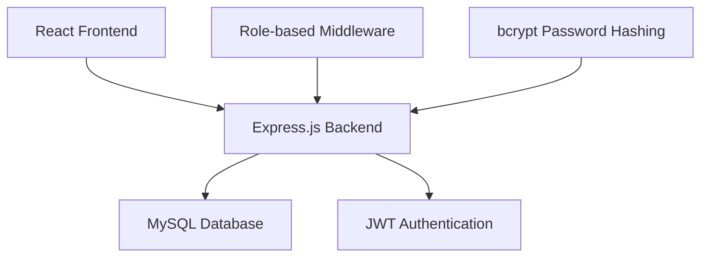

# 🚀 OpsFlow ERP/CRM System

A comprehensive Enterprise Resource Planning (ERP) and Customer Relationship Management (CRM) system built for distribution businesses. OpsFlow streamlines operations, manages inventory in real-time, and provides actionable insights through an intuitive dashboard interface.


## 📋 Table of Contents

- [🚀 OpsFlow ERP/CRM System](#-opsflow-erpcrm-system)
  - [📋 Table of Contents](#-table-of-contents)
  - [🎯 Project Overview](#-project-overview)
  - [🏗️ Architecture](#️-architecture)
  - [🛠️ Technology Stack](#️-technology-stack)
  - [📁 Project Structure](#-project-structure)
  - [⚙️ Server Setup](#️-server-setup)
    - [Backend Server Configuration](#backend-server-configuration)
    - [Frontend Server Configuration](#frontend-server-configuration)
  - [🔧 Environment Variables Management](#-environment-variables-management)
    - [Backend Environment Variables](#backend-environment-variables)
    - [Frontend Environment Variables](#frontend-environment-variables)
    - [Environment Setup Steps](#environment-setup-steps)
  - [💻 Local Development Setup](#-local-development-setup)
    - [Prerequisites](#prerequisites)
    - [Database Setup](#database-setup)
    - [Backend Setup](#backend-setup)
    - [Frontend Setup](#frontend-setup)
    - [Running the Complete Application](#running-the-complete-application)
  - [🗄️ Database Schema](#️-database-schema)
  - [🔐 Authentication & Authorization](#-authentication--authorization)
  - [📡 API Documentation](#-api-documentation)
  - [🧪 Testing](#-testing)
  - [🚀 Deployment](#-deployment)
    - [Production Deployment](#production-deployment)
    - [Docker Deployment (Optional)](#docker-deployment-optional)
    - [Environment-Specific Considerations](#environment-specific-considerations)
  - [🔍 Assumptions Made](#-assumptions-made)
    - [Technical Assumptions](#technical-assumptions)
    - [Business Logic Assumptions](#business-logic-assumptions)
    - [Security Assumptions](#security-assumptions)
  - [📊 Features](#-features)
  - [🛡️ Security Features](#️-security-features)
  - [🐛 Troubleshooting](#-troubleshooting)
  - [📈 Performance Considerations](#-performance-considerations)
  - [🤝 Contributing](#-contributing)
  - [📄 License](#-license)
  - [📞 Support](#-support)

## 🎯 Project Overview

OpsFlow is a full-stack ERP/CRM solution designed specifically for distribution businesses. It provides comprehensive tools for:

- **Customer Management**: Lead tracking, customer profiles, and follow-up management
- **Inventory Management**: Real-time stock tracking, low-stock alerts, and movement history
- **Sales Operations**: Challan generation, order processing, and sales analytics
- **Dashboard Analytics**: KPI monitoring, performance metrics, and business insights
- **Role-based Access Control**: Secure access management for different user roles

## 🏗️ Architecture



## 🛠️ Technology Stack

### Backend
- **Runtime**: Node.js 18+
- **Framework**: Express.js 5.x
- **Database**: MySQL 8.0+
- **ORM**: mysql2/promise (Raw SQL with connection pooling)
- **Authentication**: JSON Web Tokens (JWT)
- **Password Hashing**: bcrypt
- **Environment Management**: dotenv
- **CORS**: cors middleware
- **Development**: nodemon

### Frontend
- **Framework**: React 19.x
- **Build Tool**: Vite 8.x
- **Language**: JavaScript (ES6+)
- **Styling**: CSS3 with custom properties
- **State Management**: React Hooks
- **HTTP Client**: Fetch API
- **Development**: ESLint + React plugins

### Development Tools
- **Version Control**: Git
- **Package Manager**: npm
- **Code Quality**: ESLint
- **Testing**: Custom smoke tests

## 📁 Project Structure

```
OpsFlow/
├── Backend/                    # Node.js Express API
│   ├── config/
│   │   └── db.js              # MySQL connection configuration
│   ├── controllers/           # Route controllers
│   │   ├── auth.controller.js
│   │   ├── customer.controller.js
│   │   ├── product.controller.js
│   │   ├── challan.controller.js
│   │   └── dashboard.controller.js
│   ├── middlewares/           # Custom middleware
│   │   ├── auth.middleware.js
│   │   └── role.middleware.js
│   ├── models/               # Data access layer
│   │   ├── user.model.js
│   │   ├── customer.model.js
│   │   └── product.model.js
│   ├── routes/               # API routes
│   │   ├── auth.routes.js
│   │   ├── customer.routes.js
│   │   └── product.routes.js
│   ├── tests/                # Test files
│   │   └── api-smoke-test.js
│   ├── utils/                # Utility functions
│   │   └── transaction.js
│   ├── .env.example          # Environment template
│   ├── package.json
│   ├── server.js             # Main server file
│   └── setup-test-data.js    # Test data generator
│
├── Frontend/                  # React Vite application
│   ├── public/
│   │   ├── favicon.svg
│   │   └── icons.svg
│   ├── src/
│   │   ├── assets/           # Static assets
│   │   ├── components/       # Reusable components
│   │   │   ├── ui/           # UI components
│   │   │   ├── layout/       # Layout components
│   │   │   └── dashboard/    # Dashboard components
│   │   ├── hooks/            # Custom React hooks
│   │   ├── pages/            # Page components
│   │   ├── services/         # API services
│   │   ├── App.jsx           # Main app component
│   │   ├── main.jsx          # React entry point
│   │   └── index.css         # Global styles
│   ├── .env.example          # Environment template
│   ├── package.json
│   ├── vite.config.js        # Vite configuration
│   └── eslint.config.js      # ESLint configuration
│
├── README.md                 # This file
└── .gitignore               # Git ignore rules
```

## ⚙️ Server Setup

### Backend Server Configuration

The backend server is built on **Express.js** with the following key configurations:

```javascript
// server.js - Main server configuration
const express = require("express");
const cors = require("cors");
const app = express();

// Middleware stack
app.use(cors());                    // Enable cross-origin requests
app.use(express.json());            // Parse JSON payloads
app.use(express.urlencoded({ extended: true })); // Parse URL-encoded data

// Route configuration
app.use("/api/auth", authRoutes);
app.use("/api/customers", customerRoutes);
app.use("/api/products", productRoutes);
app.use("/api/challans", challanRoutes);
app.use("/api/dashboard", dashboardRoutes);
```

**Key Server Features:**
- **Connection Pooling**: MySQL2 connection pooling for optimal performance
- **CORS Configuration**: Enables cross-origin requests for frontend communication
- **JSON/URL-encoded Parsing**: Handles various content types
- **Error Handling**: Centralized error handling with proper HTTP status codes
- **Health Check Endpoint**: `/db-test` for monitoring database connectivity

### Frontend Server Configuration

The frontend uses **Vite** for development and build processes:

```javascript
// vite.config.js
import { defineConfig } from 'vite'
import react from '@vitejs/plugin-react'

export default defineConfig({
  plugins: [react()],
  server: {
    port: 3000,                    // Development server port
    proxy: {                       // API proxy configuration
      '/api': 'http://localhost:5000'
    }
  }
})
```

**Frontend Server Features:**
- **Hot Module Replacement (HMR)**: Instant updates during development
- **Fast Builds**: Optimized build process with Vite
- **Development Proxy**: Seamless API communication during development
- **Asset Optimization**: Automatic asset bundling and optimization

## 🔧 Environment Variables Management

### Backend Environment Variables

Create `.env` file in the `Backend/` directory:

```env
# Server Configuration
PORT=5000                           # Backend server port

# Database Configuration
DB_HOST=localhost                   # MySQL host
DB_USER=root                        # MySQL username
DB_PASSWORD=your_secure_password    # MySQL password
DB_NAME=erp_crm                     # Database name

# Authentication Configuration
JWT_SECRET=your_jwt_secret_key_here              # Primary JWT secret
ACCESS_TOKEN_SECRET=your_access_token_secret     # Fallback JWT secret

# Optional Development Overrides
BASE_URL=http://127.0.0.1:5000     # Base URL for testing
SMOKE_PASSWORD=StrongPass123!       # Password for smoke tests
```

### Frontend Environment Variables

Create `.env` file in the `Frontend/` directory:

```env
# API Configuration
VITE_API_BASE_URL=http://127.0.0.1:5000    # Backend API URL

# Development Configuration
VITE_DASHBOARD_USE_MOCK=false               # Use mock data for development
```

### Environment Setup Steps

1. **Copy Environment Templates:**
   ```bash
   # Backend
   cd Backend
   cp .env.example .env
   
   # Frontend
   cd ../Frontend
   cp .env.example .env
   ```

2. **Configure Database Settings:**
   - Update `DB_HOST`, `DB_USER`, `DB_PASSWORD` in backend `.env`
   - Ensure MySQL service is running
   - Create database: `CREATE DATABASE erp_crm;`

3. **Generate JWT Secrets:**
   ```bash
   # Generate secure random strings
   node -e "console.log(require('crypto').randomBytes(64).toString('hex'))"
   ```

4. **Update API URLs:**
   - Set `VITE_API_BASE_URL` to match your backend URL
   - For production, use your deployed backend URL

## 💻 Local Development Setup

### Prerequisites

Before setting up the project, ensure you have:

- **Node.js 18+** ([Download](https://nodejs.org/))
- **MySQL 8.0+** ([Download](https://dev.mysql.com/downloads/mysql/))
- **Git** ([Download](https://git-scm.com/downloads))
- **npm** (comes with Node.js)

### Database Setup

1. **Install and Start MySQL:**
   ```bash
   # Windows (using MySQL Installer)
   # Download from: https://dev.mysql.com/downloads/installer/
   
   # macOS (using Homebrew)
   brew install mysql
   brew services start mysql
   
   # Ubuntu/Debian
   sudo apt update
   sudo apt install mysql-server
   sudo systemctl start mysql
   ```

2. **Create Database:**
   ```sql
   mysql -u root -p
   CREATE DATABASE erp_crm;
   CREATE USER 'erp_user'@'localhost' IDENTIFIED BY 'secure_password';
   GRANT ALL PRIVILEGES ON erp_crm.* TO 'erp_user'@'localhost';
   FLUSH PRIVILEGES;
   EXIT;
   ```

3. **Set Up Tables and Test Data:**
   ```bash
   cd Backend
   node setup-test-data.js
   ```

### Backend Setup

1. **Navigate to Backend Directory:**
   ```bash
   cd Backend
   ```

2. **Install Dependencies:**
   ```bash
   npm install
   ```

3. **Configure Environment:**
   ```bash
   cp .env.example .env
   # Edit .env with your database credentials
   ```

4. **Start Development Server:**
   ```bash
   npm run dev
   ```

   The backend will be available at `http://localhost:5000`

5. **Verify Setup:**
   ```bash
   # Test database connection
   curl http://localhost:5000/db-test
   
   # Run smoke tests
   npm run test:smoke
   ```

### Frontend Setup

1. **Navigate to Frontend Directory:**
   ```bash
   cd Frontend
   ```

2. **Install Dependencies:**
   ```bash
   npm install
   ```

3. **Configure Environment:**
   ```bash
   cp .env.example .env
   # Update VITE_API_BASE_URL if needed
   ```

4. **Start Development Server:**
   ```bash
   npm run dev
   ```

   The frontend will be available at `http://localhost:3000`

### Running the Complete Application

1. **Start Backend** (Terminal 1):
   ```bash
   cd Backend
   npm run dev
   ```

2. **Start Frontend** (Terminal 2):
   ```bash
   cd Frontend
   npm run dev
   ```

3. **Access Application:**
   - Frontend: `http://localhost:3000`
   - Backend API: `http://localhost:5000`
   - API Health Check: `http://localhost:5000/db-test`

4. **Login with Test Credentials:**
   - **Admin**: admin@opsflow.com / password123
   - **Sales**: sales@opsflow.com / password123
   - **Warehouse**: warehouse@opsflow.com / password123
   - **Accounts**: accounts@opsflow.com / password123

## 🗄️ Database Schema

The application uses a relational MySQL database with the following key tables:

```sql
-- Core Tables
users              # User accounts and roles
customers           # Customer management
products            # Product catalog
customer_followups  # Customer interaction history
stock_movements     # Inventory transaction log
sales_challans      # Sales order headers
challan_items      # Sales order line items
```

**Key Relationships:**
- Users → Customer Followups (created_by)
- Users → Stock Movements (created_by)  
- Users → Sales Challans (created_by)
- Customers → Customer Followups (customer_id)
- Customers → Sales Challans (customer_id)
- Products → Stock Movements (product_id)
- Products → Challan Items (product_id)
- Sales Challans → Challan Items (challan_id)

## 🔐 Authentication & Authorization

### Authentication Flow
1. **Registration**: `POST /api/auth/register`
2. **Login**: `POST /api/auth/login` → Returns JWT token
3. **Protected Routes**: Include `Authorization: Bearer <token>` header
4. **Token Verification**: Middleware validates JWT and extracts user info

### Role-Based Access Control

| Role | Permissions |
|------|------------|
| **Admin** | Full system access, user management, all CRUD operations |
| **Sales** | Customer management, challans, product viewing, dashboard |
| **Warehouse** | Inventory management, stock movements, product viewing |
| **Accounts** | Financial data access, reporting, transaction history |

### Security Features
- **Password Hashing**: bcrypt with salt rounds
- **JWT Tokens**: Secure token-based authentication
- **Route Protection**: Middleware-based authorization
- **Role Validation**: Fine-grained permission control
- **CORS Protection**: Cross-origin request security

## 📡 API Documentation

### Authentication Endpoints
```
POST /api/auth/register    # Register new user
POST /api/auth/login       # User login
GET  /api/auth/me          # Get current user profile
```

### Customer Management
```
GET    /api/customers           # List customers (with search & pagination)
POST   /api/customers           # Create new customer
GET    /api/customers/:id       # Get customer details
PUT    /api/customers/:id       # Update customer
DELETE /api/customers/:id       # Delete customer
POST   /api/customers/:id/followups    # Add follow-up
GET    /api/customers/:id/followups    # Get customer follow-ups
```

### Product & Inventory Management
```
GET    /api/products                    # List products (with search)
POST   /api/products                    # Create product (Admin only)
GET    /api/products/:id                # Get product details
PUT    /api/products/:id                # Update product (Admin only)
DELETE /api/products/:id                # Delete product (Admin only)
GET    /api/products/low-stock          # Get low-stock alerts
POST   /api/products/:id/stock/in       # Add stock (Warehouse)
POST   /api/products/:id/stock/out      # Remove stock (Warehouse)
GET    /api/products/:id/movements      # Stock movement history
```

### Sales & Challan Management
```
GET    /api/challans           # List challans (with filters)
POST   /api/challans           # Create draft challan
GET    /api/challans/:id       # Get challan details
POST   /api/challans/:id/confirm   # Confirm draft challan
POST   /api/challans/:id/cancel    # Cancel draft challan
```

### Dashboard & Analytics
```
GET /api/dashboard              # Dashboard KPIs and metrics
GET /api/dashboard/low-stock    # Low-stock product alerts
```

## 🧪 Testing

### Backend Testing
```bash
# Run smoke tests
cd Backend
npm run test:smoke

# Test specific endpoints
curl -X GET http://localhost:5000/db-test
curl -X POST http://localhost:5000/api/auth/login \
  -H "Content-Type: application/json" \
  -d '{"email":"demo@opsflow.com","password":"password123"}'
```

### Frontend Testing
```bash
# Lint code
cd Frontend
npm run lint

# Build for production (test build process)
npm run build

# Preview production build
npm run preview
```

### Test Data
- Pre-configured test users with different roles
- Sample customers, products, and transactions
- Realistic business scenarios for testing
- See `TEST_CREDENTIALS.md` for details

## 🚀 Deployment

### Production Deployment

#### Backend Deployment

1. **Prepare Production Environment:**
   ```bash
   # Set production environment variables
   export NODE_ENV=production
   export PORT=5000
   export DB_HOST=your_production_db_host
   export DB_USER=your_production_db_user
   export DB_PASSWORD=your_production_db_password
   export JWT_SECRET=your_production_jwt_secret
   ```

2. **Install Dependencies:**
   ```bash
   cd Backend
   npm install --production
   ```

3. **Start Production Server:**
   ```bash
   npm start
   # or use PM2 for process management
   npm install -g pm2
   pm2 start server.js --name "opsflow-backend"
   ```

#### Frontend Deployment

1. **Build for Production:**
   ```bash
   cd Frontend
   npm run build
   ```

2. **Deploy Built Files:**
   ```bash
   # Copy dist/ folder to your web server
   # For nginx, Apache, or static hosting services
   cp -r dist/* /var/www/html/
   ```

3. **Configure Web Server:**
   ```nginx
   # nginx configuration
   server {
       listen 80;
       server_name your-domain.com;
       root /var/www/html;
       index index.html;
       
       location / {
           try_files $uri $uri/ /index.html;
       }
       
       location /api/ {
           proxy_pass http://localhost:5000;
           proxy_set_header Host $host;
           proxy_set_header X-Real-IP $remote_addr;
       }
   }
   ```

### Docker Deployment (Optional)

1. **Backend Dockerfile:**
   ```dockerfile
   FROM node:18-alpine
   WORKDIR /app
   COPY package*.json ./
   RUN npm install --production
   COPY . .
   EXPOSE 5000
   CMD ["npm", "start"]
   ```

2. **Frontend Dockerfile:**
   ```dockerfile
   FROM node:18-alpine as build
   WORKDIR /app
   COPY package*.json ./
   RUN npm install
   COPY . .
   RUN npm run build
   
   FROM nginx:alpine
   COPY --from=build /app/dist /usr/share/nginx/html
   EXPOSE 80
   ```

3. **Docker Compose:**
   ```yaml
   version: '3.8'
   services:
     backend:
       build: ./Backend
       ports:
         - "5000:5000"
       environment:
         - DB_HOST=mysql
         - DB_USER=root
         - DB_PASSWORD=password
         - JWT_SECRET=your-secret
     
     frontend:
       build: ./Frontend
       ports:
         - "80:80"
     
     mysql:
       image: mysql:8.0
       environment:
         - MYSQL_ROOT_PASSWORD=password
         - MYSQL_DATABASE=erp_crm
       volumes:
         - mysql_data:/var/lib/mysql
   
   volumes:
     mysql_data:
   ```

### Environment-Specific Considerations

#### Development
- Use `nodemon` for auto-restart
- Enable detailed error logging
- Use local MySQL instance
- CORS allows all origins

#### Staging
- Mirror production configuration
- Use staging database
- Enable request logging
- Test deployment process

#### Production
- Use process managers (PM2, systemd)
- Implement proper logging
- Configure reverse proxy (nginx)
- Enable SSL/HTTPS
- Database connection pooling
- Monitoring and alerts

## 🔍 Assumptions Made

### Technical Assumptions

1. **Database Design:**
   - MySQL 8.0+ with InnoDB storage engine
   - UTF-8 character encoding for international support
   - Auto-incrementing primary keys for all entities
   - Soft deletes not implemented (hard deletes used)
   - Foreign key constraints enabled for data integrity

2. **Authentication:**
   - JWT tokens don't expire (production should implement expiration)
   - Single-session per user (no multi-device session management)
   - Password reset functionality not implemented
   - No social login integration (Google/Microsoft buttons removed)

3. **API Design:**
   - RESTful API principles followed
   - JSON-only communication format
   - Pagination implemented with limit/offset
   - Search implemented with LIKE queries (not full-text search)

4. **Frontend Architecture:**
   - Single-page application (SPA) model
   - Local storage for session management
   - No offline capability
   - Desktop-first design (responsive for tablets/mobile)

### Business Logic Assumptions

1. **Inventory Management:**
   - Stock levels cannot go negative
   - Stock movements are logged for audit trail
   - Low-stock alerts based on minimum_stock threshold
   - No stock reservations or pending allocations

2. **Sales Process:**
   - Challans (delivery orders) are the primary sales document
   - Draft → Confirmed → Completed workflow
   - No invoice generation (challans serve as sales proof)
   - No payment tracking or accounts receivable

3. **Customer Management:**
   - Lead → Prospect → Customer lifecycle
   - Single contact person per customer
   - No customer credit limits or payment terms
   - Follow-ups are manual (no automated reminders)

4. **User Roles:**
   - Four-tier role system (Admin, Sales, Warehouse, Accounts)
   - Role-based access control at API level
   - No hierarchical permissions or department-based access
   - Admin has full system access

### Security Assumptions

1. **Environment Security:**
   - Application runs in trusted network environment
   - Database server not directly accessible from internet
   - Regular security updates applied to dependencies
   - No rate limiting implemented (should be added for production)

2. **Data Protection:**
   - Passwords hashed with bcrypt (10 rounds)
   - JWT secrets properly configured and secured
   - No PII encryption beyond password hashing
   - No GDPR compliance features implemented

3. **Input Validation:**
   - Basic server-side validation implemented
   - SQL injection prevented through parameterized queries
   - XSS protection relies on React's built-in escaping
   - No file upload functionality (reduces attack surface)

## 📊 Features

### Current Features ✅
- **User Authentication & Authorization**
- **Customer Management** (CRUD operations)
- **Product Catalog Management**
- **Inventory Tracking & Stock Movements**
- **Sales Challan Generation**
- **Dashboard Analytics & KPIs**
- **Role-based Access Control**
- **Real-time Low Stock Alerts**
- **Customer Follow-up Tracking**
- **Responsive Design**

### Planned Features 🚧
- **Invoice Generation**
- **Payment Tracking**
- **Advanced Reporting**
- **Email Notifications**
- **File Upload Support**
- **Multi-currency Support**
- **Automated Backups**
- **API Rate Limiting**

## 🛡️ Security Features

- **Password Hashing**: bcrypt with salt
- **JWT Authentication**: Stateless token-based auth
- **SQL Injection Protection**: Parameterized queries
- **CORS Configuration**: Cross-origin security
- **Role-based Authorization**: Fine-grained permissions
- **Input Validation**: Server-side validation
- **Error Handling**: Secure error messages

## 🐛 Troubleshooting

### Common Issues

1. **Database Connection Failed**
   ```bash
   # Check MySQL service
   sudo systemctl status mysql
   
   # Verify credentials
   mysql -u root -p
   
   # Check .env configuration
   cat Backend/.env
   ```

2. **JWT Token Issues**
   ```bash
   # Verify JWT_SECRET is set
   echo $JWT_SECRET
   
   # Clear browser local storage
   # localStorage.clear() in browser console
   ```

3. **CORS Errors**
   ```javascript
   // Verify CORS configuration in server.js
   app.use(cors({
     origin: 'http://localhost:3000', // Frontend URL
     credentials: true
   }));
   ```

4. **Port Already in Use**
   ```bash
   # Find process using port
   lsof -i :5000
   
   # Kill process
   kill -9 <PID>
   
   # Or change port in .env
   PORT=5001
   ```

### Performance Issues

1. **Slow Database Queries**
   ```sql
   -- Add indexes for frequently queried columns
   CREATE INDEX idx_customers_name ON customers(name);
   CREATE INDEX idx_products_sku ON products(sku);
   CREATE INDEX idx_challans_status ON sales_challans(status);
   ```

2. **Large Response Times**
   - Implement pagination for large datasets
   - Add database connection pooling
   - Use CDN for static assets
   - Enable gzip compression

## 📈 Performance Considerations

### Database Optimization
- Connection pooling configured
- Indexed columns for search queries
- Proper foreign key constraints
- Transaction handling for data consistency

### Frontend Optimization
- Vite for fast builds and HMR
- Component-based architecture
- Lazy loading for routes (when implemented)
- Optimized asset bundling

### API Performance
- Pagination for large data sets
- Efficient SQL queries with joins
- Response caching headers
- Proper HTTP status codes

## 🤝 Contributing

1. **Fork the Repository**
2. **Create Feature Branch**: `git checkout -b feature/new-feature`
3. **Commit Changes**: `git commit -m "Add new feature"`
4. **Push to Branch**: `git push origin feature/new-feature`
5. **Create Pull Request**

### Development Guidelines
- Follow existing code style
- Add tests for new features
- Update documentation
- Ensure all tests pass

## 📄 License

This project is licensed under the MIT License - see the [LICENSE](LICENSE) file for details.

## 📞 Support

For support and questions:

- **Email**: support@opsflow.com
- **Documentation**: [Internal Wiki](./docs/)
- **Issues**: [GitHub Issues](https://github.com/yourorg/opsflow/issues)

---

**OpsFlow** - Streamlining operations for distribution businesses worldwide.

*Built with ❤️ by the OpsFlow Team*